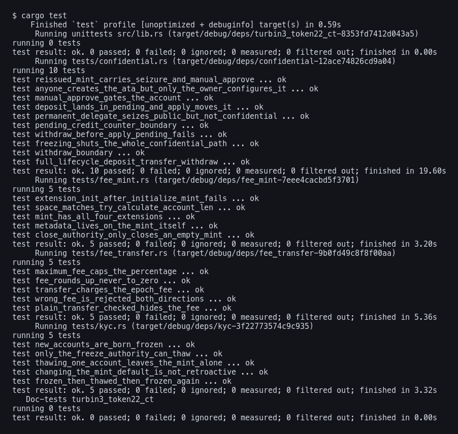

# Token-2022 Remittance Stablecoin + Confidential Transfers

Week 4 for Turbin3. Two mints.

**Mint A** is the remittance stablecoin: a fee on every transfer that the issuer
can collect, metadata sitting on the mint itself, every new account frozen until
KYC clears, and a close authority so the thing can be decommissioned.

**Mint B** is the same token re-issued with a seizure authority and confidential
transfers turned on, because confidential transfers cannot be added to a mint
that already exists.

25 tests, all against a local validator.

## Running it

The validator has to clone Token-2022 from mainnet. The one baked into
`solana-test-validator` is compiled **without the `zk-ops` feature**, so every
confidential instruction comes back `InvalidInstructionData` and you go looking
for a bug in your own code for an hour. Ask me how I know.

```bash
solana-test-validator --quiet --reset \
  --url https://api.mainnet-beta.solana.com \
  --clone-upgradeable-program TokenzQdBNbLqP5VEhdkAS6EPFLC1PHnBqCXEpPxuEb &

cargo test
```



---

## Mint A, and why the instruction order isn't a style choice

`src/fee_mint.rs`. One transaction, six instructions, this order:

| # | instruction | why |
|---|---|---|
| 1 | `create_account` | sized by `ExtensionType::try_calculate_account_len::<Mint>` |
| 2 | `initialize_transfer_fee_config` | 500 bps, `maximum_fee` 1000 |
| 3 | `metadata_pointer::initialize` | `metadata_address = the mint itself` |
| 4 | `initialize_default_account_state` | `Frozen` |
| 5 | `initialize_mint_close_authority` | |
| 6 | `initialize_mint2` | **last, always** |

Extensions are TLV records written after the 82 byte base. Byte 165 is the
account type discriminator, and `InitializeMint` is what stamps it. Once that
byte is set every extension init sees an initialized mint and refuses. So all
four have to land first. There's a test that moves `initialize_mint2` to
position two and watches the whole transaction die.

The space comes from `try_calculate_account_len`, not arithmetic. It dedupes,
sums the TLV records, adds the base, and then pads a mint that would otherwise
land exactly on `Multisig::LEN` so the program can still tell the two apart.
Hand computing `82 + sum` gets that last part wrong.

This mint is built from raw instructions on purpose. A client helper does the
same work, but it does it inside the crate where none of the above is visible,
and the sizing and the ordering are the two things this task is about.

### Metadata is a second transaction

`TokenMetadata` is variable length, so `try_calculate_account_len` returns an
error if you put it in the list. It isn't a mistake in the extension list. The
metadata goes on afterwards, which means the mint has to grow and get topped up
on rent first. `write_metadata` does both.

---

## The fee, and why it can't be cached

`src/fee_transfer.rs`. Every transfer reads the epoch, reads the config, and
computes the fee fresh:

```rust
let epoch = rpc.get_epoch_info().await?.epoch;
let config = state.get_extension::<TransferFeeConfig>()?;
config.calculate_epoch_fee(epoch, amount)
```

`TransferFeeConfig` holds **two** fee structs, an older and a newer, and swaps
between them at an epoch boundary. A rate you cached at mint creation is wrong
the moment the issuer calls `set_transfer_fee`.

The program doesn't take your word for it either. It recomputes the fee on chain
with its own `Clock` and compares:

```rust
if calculated_fee != fee {
    return Err(TokenError::FeeMismatch.into());
}
```

That's `!=`, so it's tight in both directions. You can't underpay and you can't
overpay. There's a test for each side.

### The thing that surprised me

`transfer_checked` is **not** rejected on a fee mint. I assumed it would be and
wrote a test asserting it, and the test failed. What actually happens is it goes
through and silently takes the fee anyway, so you send 10000 and the recipient
gets 9500 without anyone having acknowledged a fee exists.

`transfer_checked_with_fee` is the one that makes the caller state the number up
front and refuses if it's wrong. Same money moves. The difference is that a
client running on a stale rate finds out at the boundary instead of handing
somebody a receipt that doesn't match what landed.

---

## KYC

`src/kyc.rs`. Two levers that are easy to confuse:

- **`thaw`** — one account, right now, signed by the freeze authority
- **`update_default_account_state`** — what the *next* account looks like

They don't touch each other, and both directions are tested. Thawing Alice
leaves the mint still saying `Frozen` and Bob still shows up frozen. Flipping
the mint to `Initialized` lets Bob's new account through but leaves Alice's
existing frozen account exactly as frozen as it was. That second one is the
half people get wrong.

---

## Mint B and the confidential lifecycle

`src/ct_mint.rs`, `src/confidential.rs`.

Confidential transfers can't be bolted onto mint A. The extension list is fixed
at `InitializeMint`, so the only way to add them is a new mint. **That is the gap
between the two requirements** the assignment asks about, and it's why the word
in the task is "re-issue".

Mint B deliberately does **not** carry the transfer fee. The moment a mint has
both, Token-2022 also wants a `ConfidentialTransferFeeConfig`, and every
confidential transfer then needs two extra proofs plus a withheld fee ciphertext
somebody has to decrypt later. Nothing in the rubric asks for that, so the fee
stays on mint A and the confidentiality stays on mint B.

`auto_approve_new_accounts: false` is what `approve_policy = manual` means.

### The order, and who signs what

| step | signer |
|---|---|
| create the ATA | **anyone** — the payer, owner doesn't sign |
| `Reallocate` | owner |
| `ConfigureAccount` | **owner only** |
| `ApproveAccount` | the issuer |
| `Deposit` | owner |
| `ApplyPendingBalance` | owner |
| `Transfer` | sender |
| `ApplyPendingBalance` | recipient |
| `Withdraw` | recipient |

The ATA-vs-Configure split isn't a convention, it's structural. The ElGamal and
AES keys are derived by having the owner **sign a message**, so there is nothing
a third party could even put in the account. A test has the payer create Alice's
account fine and then get rejected trying to configure it.

### Three things that cost me real time

**1. `Reallocate` first.** The ATA program sizes an account for the mint's
*required* extensions, and `ConfidentialTransferAccount` is optional, so it isn't
in there. `ConfigureAccount` then fails with `InvalidAccountData`, which tells
you nothing. The token-2022 source says it outright: *"The caller is expected to
use the `Reallocate` instruction to ensure there is sufficient room."*

**2. Pending is not available.** A deposit or an incoming transfer lands in
**pending**. Withdraw builds its proof off the **available** ciphertext. Skip
`ApplyPendingBalance` and you're proving something about the wrong number, and it
fails in proof generation on the client before anything is ever sent, so there's
nothing in the validator logs to find. `withdraw_before_apply_pending_fails`
pins it.

**3. The proofs don't fit in a transaction.** One withdraw inlined is 2284 bytes
against a 1232 limit. So each proof gets verified into its own throwaway account
first, the token instruction points at those accounts, and then they get closed
and the rent comes back. A transfer needs three of them (equality, ciphertext
validity, range), a withdraw needs two.

---

## The sanctioned user question

**What happens if a sanctioned user moves their balance into the confidential
system before the permanent delegate acts?**

They win. The seizure authority can't touch it.

`grep -rn "PermanentDelegate" extension/confidential_transfer/processor.rs`
returns nothing. There is no instruction path from the permanent delegate into
the confidential system at all. The delegate works through `TransferChecked`,
which reads `base.amount` — the public balance. Once the user calls `Deposit` and
then `ApplyPendingBalance`, `base.amount` is zero and the value is an ElGamal
ciphertext in `ConfidentialTransferAccount.available_balance`.

The delegate can't build a confidential transfer, because that needs proofs
derived from the owner's secret key. And it can't build a public one, because
there's nothing public left. `permanent_delegate_seizes_public_but_not_confidential`
demonstrates both halves: the seizure works on the public balance, then the user
deposits and applies, and the exact same seizure fails while the 800 tokens are
still sitting right there.

### What the issuer actually still has

| lever | what it does | what it doesn't |
|---|---|---|
| freeze authority | blocks every confidential instruction | doesn't seize — the money is stuck, not recovered |
| `approve_policy = manual` | never approve the account in the first place | prospective only, useless once approved |
| `auditor_elgamal_pubkey` | decrypt every transfer amount | visibility, not control |
| permanent delegate | takes the public balance | stops dead at the ciphertext |

Freeze is the one that still bites. The confidential processor checks
`base.is_frozen()` at six separate sites, and
`freezing_shuts_the_whole_confidential_path` confirms deposit, transfer and
withdraw all die once the account is frozen. But freezing converts a **seizure**
control into a **containment** control. The funds stop moving. They never become
yours.

### The actual conclusion

Manual approve is a **pre**-control. The permanent delegate is a **post**-control.
The confidential extension turns every post-control into freeze-only.

So the two requirements in the scenario don't compose the way the regulator
probably assumes. They overlap on the public balance and nowhere else. If a
compliance design assumes clawback always works, the confidential extension
breaks that assumption, and the only place you get it back is at approval time —
which is exactly why `approve_policy = manual` is sitting next to
`PermanentDelegate` in this assignment.

One more thing worth saying: set `auditor_elgamal_pubkey` **at mint creation**.
It only buys visibility, not control, but if you leave the confidential transfer
authority as `None` you can never add it later. Mint B here leaves it unset,
which in a real deployment would be the wrong call.

---

## About the dependencies

`Cargo.toml` is pinned harder than it looks like it needs to be. Two reasons,
both real.

**`spl-token-client` isn't in here, and that isn't a preference.** It can't be
built at any published version right now. It requires `spl-memo-interface 2.1`,
which requires `solana-instruction 3.4`, but its own source needs
`solana-transaction 3.x`, and no `solana-rpc-client` release satisfies both.
Upstream `main` has the identical problem. So everything is raw instruction
builders, which is honestly closer to what the assignment was asking to see
anyway.

**`solana-zk-sdk` must be 7, not 4.** zk-sdk 4 generates proofs without hashing
the public key into the Fiat-Shamir transcript. Its own doc comment says so:

> The function does *not* hash the public key into the transcript.

That's the bug the ZK ElGamal proof program was taken offline for in June 2025.
The redeployed program rejects those proofs, and the error you get is
`SigmaProof(PubkeyValidity, AlgebraicRelation)`, which is not a helpful sentence
at 2am. Version 7 adds `hash_context_into_transcript` and the proofs verify.

`src/ct_helpers.rs` is copied from `spl-token-client`, with a note at the top
saying so. Those three structs used to live in `spl-token-2022`, got moved into
the client, and the client is the crate that doesn't build. There is nowhere
else to get them. All they do is pull ciphertexts off an account and hand them
to the proof generator in the right shape.

---

## What's where

| path | covers |
|---|---|
| `src/fee_mint.rs` | task 1 — the six instructions and the sizing |
| `src/fee_transfer.rs` | task 2 — `transfer_checked_with_fee` + `calculate_epoch_fee` |
| `src/inspect.rs` | task 3 — every read goes through `StateWithExtensions` |
| `src/kyc.rs` | task 4 — thaw, freeze, default state |
| `src/ct_mint.rs` | task 5 — permanent delegate + manual approve |
| `src/confidential.rs` | task 6 — the whole lifecycle |
| `src/ct_helpers.rs` | vendored, see above |
| README → sanctioned user | the written finding |

Nothing anywhere calls `Mint::unpack` or `Account::unpack`. Every read is
`StateWithExtensions`, because the raw unpack only sees the first 82 bytes and
would miss every extension on the account.

---

## Tests

25, all on a real validator.

**Boundaries.** Every operator below was read off the token-2022 source, not
guessed, and three of them were wrong in my first draft:

| boundary | cases | operator |
|---|---|---|
| `maximum_fee` cap | 10000→500 / 20000→exactly 1000 / 20001→capped | `cmp::min`, binds strictly above |
| fee rounding | 0→0 / **1→1** / 20→1 | `ceil_div`, never rounds to zero |
| supplied vs computed fee | fee-1 fails / exact ok / fee+1 fails | `!=`, tight both ways |
| pending credit counter | under / **exactly max ok** / max+1 fails | `new > maximum` |
| confidential withdraw | available-1 / exactly available / +1 fails | fails client side in proof generation |
| mint close | supply 0 closes / supply 1 rejected | `== 0` |

The one I had backwards: the pending balance credit counter check is `>`, so
landing exactly on the maximum is fine. And a 5% fee on an amount of 1 costs 1,
not 0, because it's `ceil_div` — if it floored you could move any amount for
free one unit at a time.

**Failure paths.** Ten of the 25 pass by failing: wrong instruction order, wrong freeze authority, wrong
fee both directions, unapproved account depositing, payer configuring somebody
else's account, withdrawing before applying, withdrawing more than you have,
closing a mint with supply, everything on a frozen account, and the permanent
delegate reaching for a confidential balance.

---

## Not done

The optional extension challenge (the delegated-transfer program plus CPI
Guard). The interesting part of it is that CPI Guard blocks
`Transfer`/`TransferChecked`/`TransferCheckedWithFee` through a CPI when the
**account owner** is the authority, and deliberately leaves the path open when a
**delegate** signs — the check is literally
`*authority_info.key == source_account.base.owner`. So the agent pattern keeps
working with the guard on. I didn't build it.

---

*Turbin3 Q3 2026 — Assignment 05*
